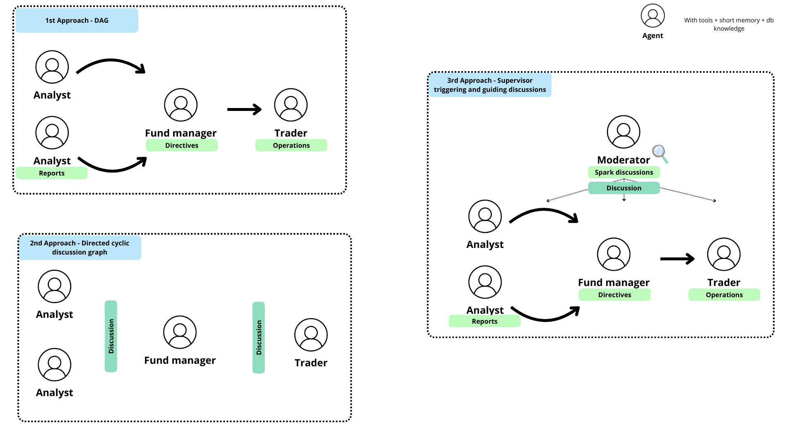

# Dystopic Investment AIgents

**AI agents fully managing the Fund**, predicting utopic/dystopic futures and uncovering the companies ready to dominate them.

The project consists of two main components: data ingestion and AI agent workflows.

* Note: This project is under development, for exploring the LLM Agentic patterns. The market is complex, do not take any investment decision based on this project.
* Originally we splitted ingestion and agents to digest and preporcess info for the agents to operate, and to be able to run them independently. This potentially may change.


<br>

## ☁️ Data ingestion (Orchestated load and transform with Mage AI)

As a summary, we need different information sources as:
- Stock prices
- Market news (both for traded stocks & pre-IPO startups)
- Startup platforms. For now implemented:
    - Crunchbase
    - Product Hunt
- Financial reports (TBD)
- Newsletters & social feeds (TBD)

We are gathering all the financial context as possible, to make it available for the agents afterwards. Some of them would make use of macro data to detect investment trends and market sentiments, while others would be the owners of specific & optimized market actions with the price and micro data.

For more information, please refer to the [Data Ingestion README](./dystopic_investment_aigents/data_ingestion/README.md).

<br>

## 🕵️ Agents

If you want to run the agents, you can configure them in the `config/fund_config.yaml` file 

```yaml
name: Utopic Fund
description: A fund that invests in a utopic future and the companies that would make it possible.
type: discussion
manager:
  personality:
    mood: optimistic
    risk_tolerance: 0.5
  seniority: !openai_client_traceable {}
  seniority_args:
    model: gpt-4o-mini
    temperature: 0.0
analyst:
...
trader:
...

```

and run them with:

```bash
make install-agents
make run-fund
```




For more information, please refer to the [Agents README](./dystopic_investment_aigents/agents/README.md).
