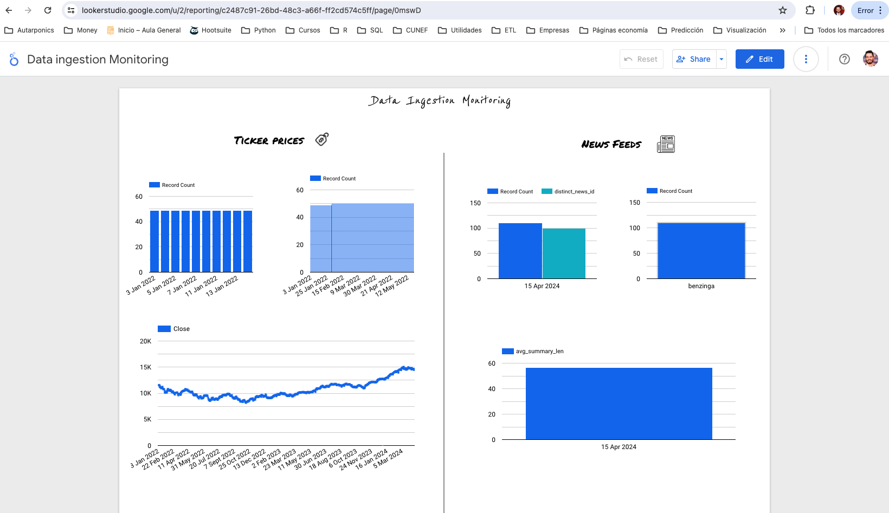
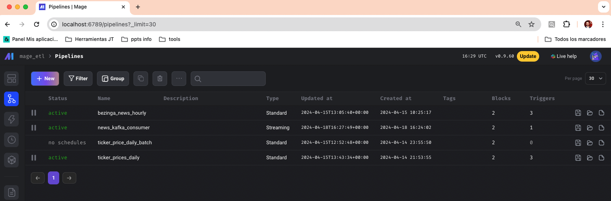
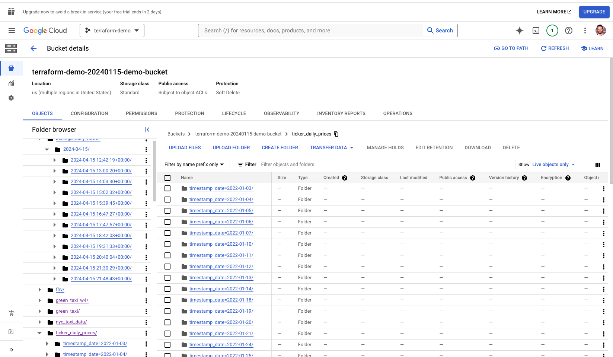

# Dystopic Investment AIgents

Dystopic stock &amp; investment indexes 📈 managed by AI agents 🤖.

The project is composed by two main pieces, base data-ingestion and agents. The **final project for Data Engineering Zoomcamp consist in the Data Ingestion & transformation part**. For that, we need different information sources as:
- Stock prices
- Market news (both for traded stocks & pre-IPO startups)
- Startup platforms (for now implemented Crunchbase)
- Financial reports (TBD)
- Newsletters & social feeds (TBD)

**[NOTE]** In recent days, my free trial of the GCP has been terminated. The project will remain inactive until the migration is completed, so I'm attaching some screenshots.

Monitoring data ingestion & modelling: [Looker Dashboard](https://lookerstudio.google.com/s/qK5FsFOEH7A)

 

## Data ingestion (Orchestated load and transform with Mage AI)

- **Ticker price data:**

For now, I developed an ingestion pipeline to daily ingest Open-High-Low-Close (OHLC) stocks data prices. 

It ingestes raw data from a Financial API to Google Cloud Storage. Then some models are created in Google Big Query partitioned by date and clustered by ticker to easier and cost effective retrieval.

- **News feeds (Batch with Mage and streaming with Kafka events):**

I've implemented two kind of news consumers. The first one is an hourly financial news insertion. It ingest raw to Google Cloud Storage.
The second one consist in a websocket that holds an open connection and acts as a Kafka producer, sending the news in Real Time through a Kafka queue to be consumed async by any service listening there. One of the listeners persists this news to Google Cloud Store. A second listener is a placeholder for an agent that may analize and perform any kind of action or analysis with that news.

- **Crunchbase data scrape (On-demand batch with Mage) To be replaced by its API:**

We are able to get main information regarding raised rounds, number of employees, lead investors, company financials...

It is a temporal PoC workaround as they have a paid API to get all this info and much more.

### 🛠 Development

**In local**

Automagically create & raises all the Mage, postgres and Kafka containers.

In case the Docker network is not created, we need to create it.

`docker network create "my-net"`

Then we are ready to start all the containers. This command will download and create all the images and launch the Kafka (zookeeper, kafka-UI, broker and topic config), Mage and our news listener producer containers.

`make start-project`

**In GCP**

Once the data lake is created, you can start/stop the Mage ETL cloud instances with:

`make mage-terraform-apply` 

`make mage-terraform-destroy`

Google Cloud Storage data lake screenshot:

Google Big Query screenshot:

 

## Agents

[TBD]
