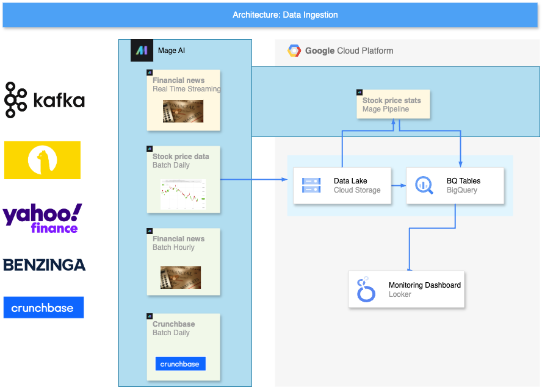
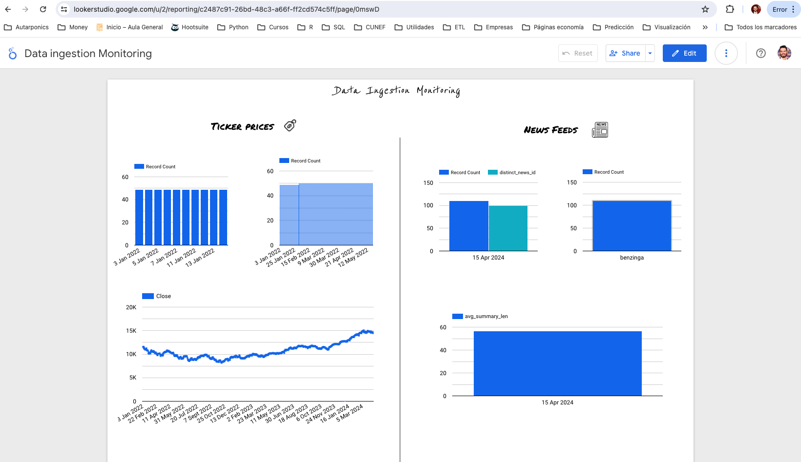
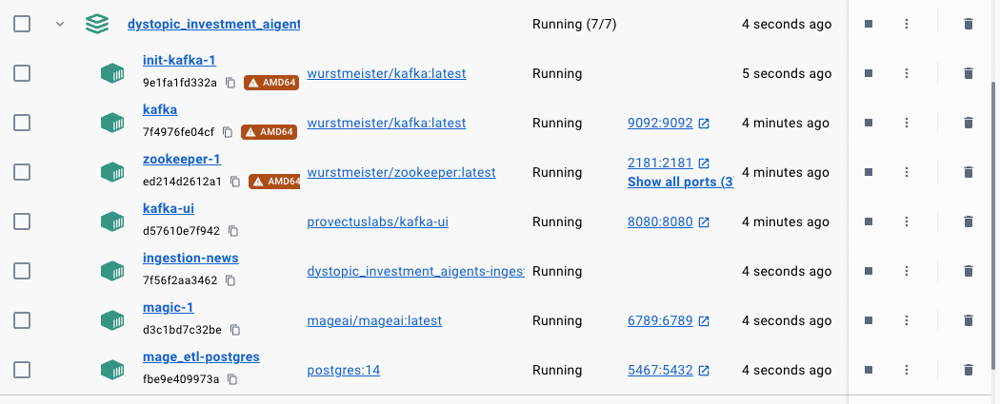
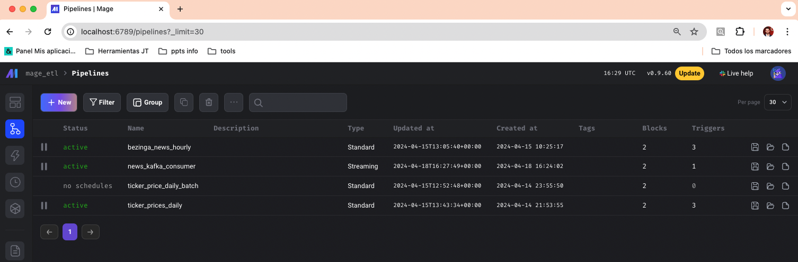
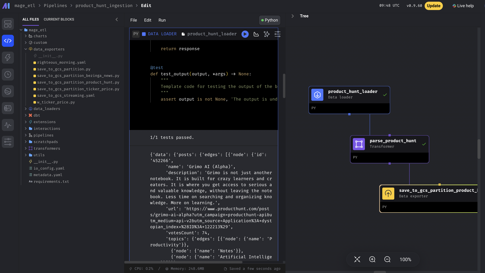
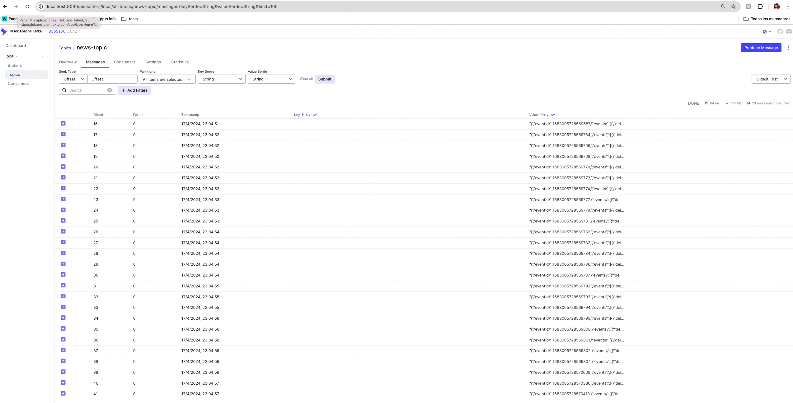
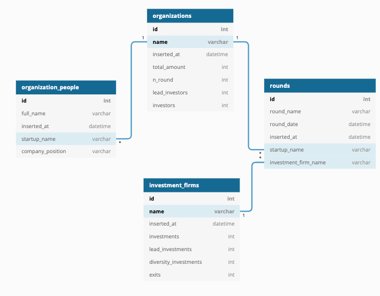
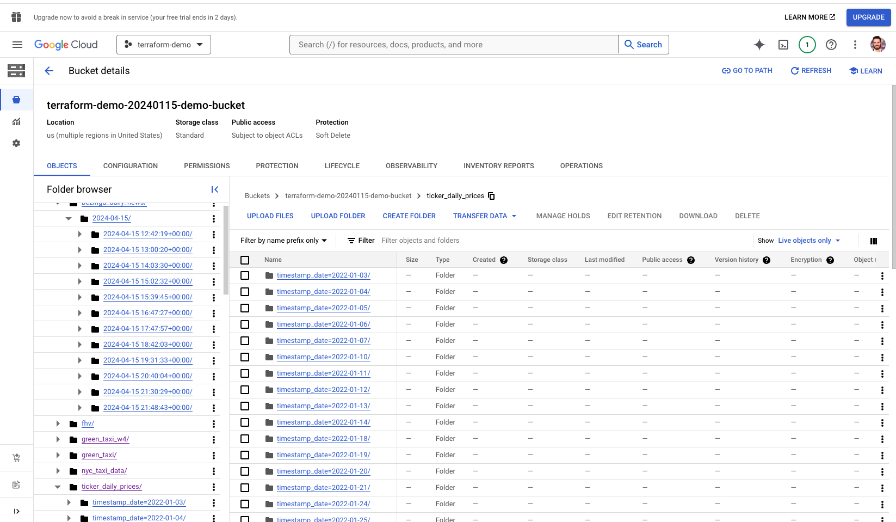
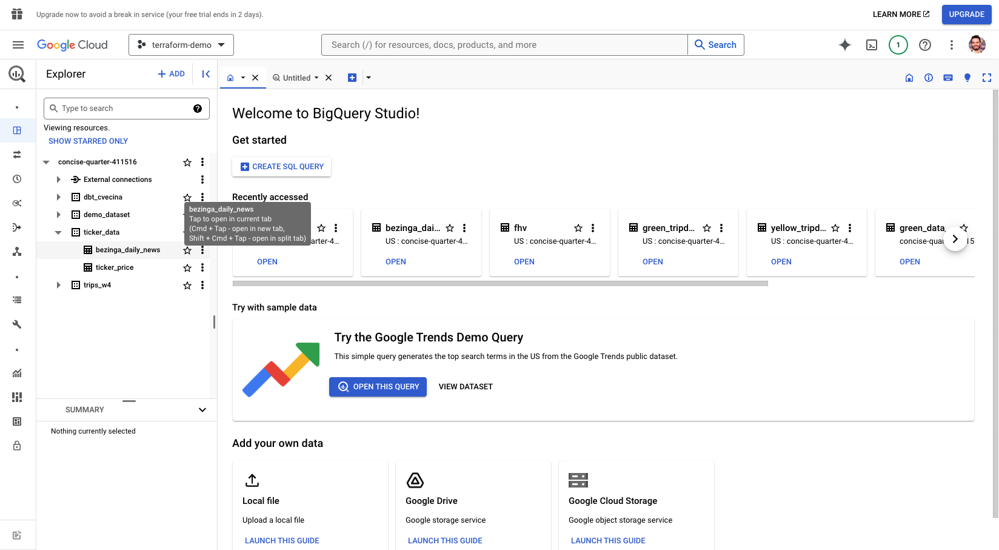

# Data Ingestion

## Data ingestion diagram

Here we can find a summary **diagram of the project components**:

**[NOTE]** In recent days, my free trial of the GCP has been terminated. The project will remain inactive until the migration is completed, so I'm attaching some screenshots.

Monitoring data ingestion & modelling: [**Looker Dashboard**](https://lookerstudio.google.com/s/qK5FsFOEH7A)

Here we have an screenshot of this project **running Docker containers**. They are defined in the `docker-compose` file, while two Docker images are created in `Dockerfile` and `Dockerfile_ingestion`.

All the ETLs are orchestated by Mage. Also, the consumer is also there, while the websocket with the Kafka producer is embebed in its own Docker image and running container.

## Data ingestion data sources

- **Ticker price data (Batch with Mage):**

For now, I developed an ingestion pipeline to daily ingest Open-High-Low-Close (OHLC) stocks data prices.

It ingestes raw data from a Financial API to Google Cloud Storage. Then some models are created in Google Big Query partitioned by date and clustered by ticker to easier and cost effective retrieval.
With Mage, a backfill run has been done, to recreate the historical prices since Jan 2022.

- **Product Hunt listings (Batch with Mage ETL or Docker container periodic API calls)**

There is a Mage pipeline with Product Hunt API data loading, transformation to Pydantic internal models and exporting to GCStorage.

This data downloading is thought to be run with Mage, it is also possible to start a Docker container calling the whole `download_product_hunt` script as main. It allows you to periodically perform API calls from the container without needing Mage ETL runs, but loosing the features it provides.

- **News feeds (Batch with Mage and streaming with Kafka events):**

I've implemented two kind of news consumers. The **first one is an hourly financial news insertion.** It ingest raw data to Google Cloud Storage.
**The second one consist in a websocket that holds an open connection and acts as a Kafka producer,** sending the news in Real Time through a Kafka queue to be consumed async by any service listening there. One of the listeners persists this news to Google Cloud Store. A second listener is a placeholder for an agent that may analize and perform any kind of action or analysis with that news.

- **Crunchbase data scrape (On-demand batch with Mage) To be replaced by its API:**

We are able to get main information regarding raised rounds, number of employees, lead investors, company financials...

It is a temporal PoC workaround as they have a paid API to get all this info and much more.

 

## Transformations

For now, just simple financial indicators are performed, apart for some parsing & data sanity checks. They can be found in `transform_basic_indicators.py` and are available to be used in the Mage ETL.

 

### 🛠 Development

This projects makes use of Python 3.11 and manages dependencies with Poetry. Also, some useful Make shortcut commands have been added.
If you want to interact with any piece of code not dockerized or in the Makefile commands, you should activate Poetry virtual env.

Make sure **you have Poetry, Python 3.11 (and `poetry env use 3.11` in your location) and Terraform** installed beforehand, then:

`make install-data-ingestion`

and activate the shell inside the virtual environment or run an specific command in that v. env:

`poetry shell` / `poetry run python ....`

The project can be launched both in local (*Docker containers + GCloud connections*) and in cloud (*Terraformed GoogleStorage, GoogleBQ and Cloud Run*). More details can be found in the next section.

Note that it uses envvars or a .env file. The project is expecting the following environment variables:

`POSTGRES_DBNAME = "pg-fin-data"`

`POSTGRES_SCHEMA= "base"`

`POSTGRES_USER= "pg"`

`POSTGRES_PASSWORD= "pgg"`

`POSTGRES_HOST= "localhost"`

`POSTGRES_PORT= "5467"`

`PROJECT_NAME = "dystopic-investment"`

`LOCAL_BOOSTRAP_SERVER = "localhost:9092"`

`BOOSTRAP_BROKER = "kafka:29092"`

**In local**

Automagically create & raises all the Mage, postgres and Kafka containers.

In case the Docker network is not created, we need to create it.

`docker network create "my-net"`

Then we are ready to start all the containers. This command will download and create all the images and launch the Kafka (zookeeper, kafka-UI, broker and topic config), Mage and our news listener producer containers.

`make start-project`

**In GCP**

First of all we need to create the data lake GCStorage and GCBig Query. We can easily do that by:

`make data-lake-terraform-apply`

Once the data lake is created, you can start/stop the Mage ETL cloud instances with:

`make mage-terraform-apply`

If you want to terminate the both previous Tf deployments, you should run:

`data-lake-terraform-apply` / `make mage-terraform-destroy`

As a way to share the cloud resources, I've created some screenshots. There we can see the data partition by date, and the clustering by tickers during the query phase.

Google Cloud Storage data lake screenshot:

Google Big Query screenshot:

 
